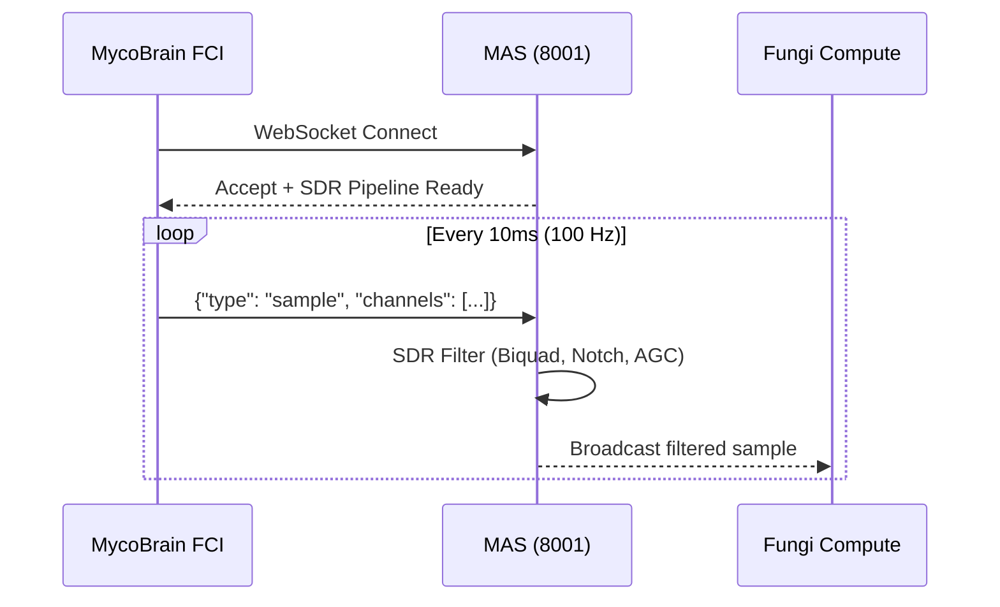
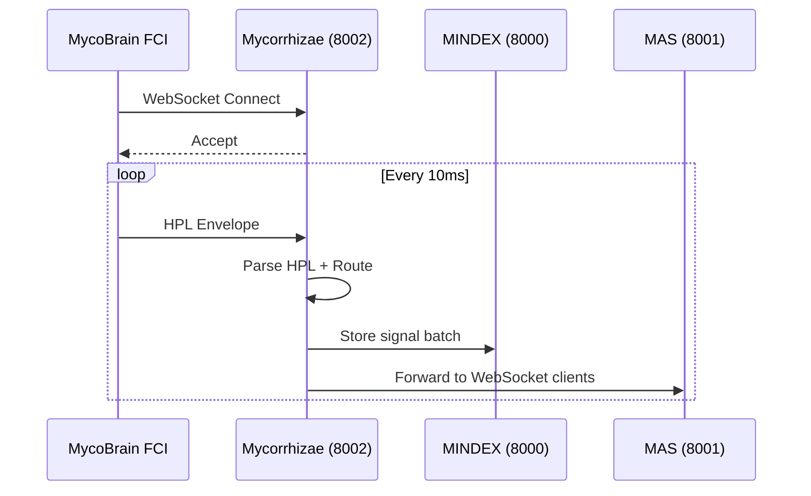

# FCI Endpoint Options for MycoBrain Firmware

**Date:** February 10, 2026  
**Version:** 1.0  
**Author:** Mycosoft Engineering

## Overview

This document describes the endpoint options available for MycoBrain FCI (Fungal Computer Interface) firmware when transmitting bioelectric signals to the backend. There are two primary routing strategies:

1. **Direct to MAS** - Low-latency path for real-time visualization
2. **Through Mycorrhizae** - Full protocol processing with storage

## Endpoint Comparison

| Feature | MAS Direct | Via Mycorrhizae |
|---------|-----------|-----------------|
| **Endpoint** | `ws://192.168.0.188:8001/api/fci/ws/stream/{device_id}` | `ws://192.168.0.188:8002/api/stream/{device_id}` |
| **Latency** | ~10-20ms | ~50-100ms |
| **SDR Processing** | Server-side (Python) | Server-side (Python) |
| **Pattern Detection** | Real-time GFST | Full HPL protocol |
| **Storage** | None (stream only) | MINDEX persistence |
| **Best For** | Live visualization | Data analysis, research |

## Option 1: Direct to MAS (Recommended for Fungi Compute)

### Firmware Configuration

```cpp
// In MycoBrain firmware config.h
#define FCI_ENDPOINT_HOST "192.168.0.188"
#define FCI_ENDPOINT_PORT 8001
#define FCI_ENDPOINT_PATH "/api/fci/ws/stream/"
#define FCI_USE_WEBSOCKET true
```

### Connection Flow



### Message Format (Firmware to MAS)

```json
{
  "type": "sample",
  "device_id": "mycobrain-001",
  "timestamp": "2026-02-10T12:34:56.789Z",
  "channels": [
    {"channel": 0, "value": 0.123, "unit": "mV"},
    {"channel": 1, "value": -0.045, "unit": "mV"},
    {"channel": 2, "value": 0.078, "unit": "mV"},
    {"channel": 3, "value": 0.201, "unit": "mV"}
  ],
  "impedance": [3200, 3150, 3300, 3100],
  "sample_rate": 128
}
```

### Server Responses

```json
// SDR config acknowledgement
{"type": "config_ack", "status": "updated"}

// Stimulation command acknowledgement  
{"type": "stimulate_ack", "status": "queued", "command_id": "uuid"}

// Pattern detection (sent to clients)
{"type": "pattern", "pattern": "spike", "confidence": 0.87, "channel": 0}
```

## Option 2: Through Mycorrhizae (For Research/Storage)

### Firmware Configuration

```cpp
// In MycoBrain firmware config.h
#define FCI_ENDPOINT_HOST "192.168.0.188"
#define FCI_ENDPOINT_PORT 8002
#define FCI_ENDPOINT_PATH "/api/stream/"
#define FCI_USE_WEBSOCKET true
```

### Connection Flow



### HPL Envelope Format

```json
{
  "envelope": {
    "version": "1.0",
    "source": "mycobrain-001",
    "destination": "fungi-compute",
    "timestamp": "2026-02-10T12:34:56.789Z",
    "signature": "ed25519:..."
  },
  "payload": {
    "type": "fci_sample",
    "data": {
      "channels": [...],
      "impedance": [...],
      "sample_rate": 128
    }
  }
}
```

## Hybrid Mode (Recommended for Production)

For production deployments, use both endpoints:

1. **Real-time data** → MAS Direct (for visualization)
2. **Batch storage** → Mycorrhizae (for persistence, every 1 second)

### Firmware Configuration

```cpp
// config.h
#define FCI_REALTIME_HOST "192.168.0.188"
#define FCI_REALTIME_PORT 8001
#define FCI_REALTIME_PATH "/api/fci/ws/stream/"

#define FCI_STORAGE_HOST "192.168.0.188"
#define FCI_STORAGE_PORT 8002
#define FCI_STORAGE_PATH "/api/stream/"
#define FCI_STORAGE_BATCH_MS 1000  // Batch every 1 second
```

## Hot-Plug Detection

When an FCI device connects or disconnects, the firmware should notify MAS:

### Device Connected
```http
POST http://192.168.0.188:8001/api/fci/devices/notify
Content-Type: application/json

{
  "device_id": "mycobrain-001",
  "event": "connected"
}
```

### Device Disconnected
```http
POST http://192.168.0.188:8001/api/fci/devices/notify
Content-Type: application/json

{
  "device_id": "mycobrain-001", 
  "event": "disconnected"
}
```

MAS will broadcast these events to all connected WebSocket clients for instant UI updates.

## Latency Optimization Tips

1. **Use binary WebSocket frames** - JSON parsing adds ~2ms overhead
2. **Batch samples** - Send 10-20 samples per message instead of 1
3. **Pre-allocate buffers** - Avoid malloc in sample loop
4. **Use hardware timers** - Consistent 128 Hz sampling
5. **Disable WiFi power saving** - `WiFi.setSleep(false)`
6. **Use static IP** - Avoids DHCP latency on reconnect

## Sample Rate Considerations

| Sample Rate | Latency Budget | Use Case |
|------------|----------------|----------|
| 10 Hz | 100ms | Environmental monitoring |
| 100 Hz | 10ms | Standard FCI readings |
| 128 Hz | 7.8ms | Spike detection (Adamatzky) |
| 250 Hz | 4ms | High-fidelity research |
| 1000 Hz | 1ms | Action potential capture |

For spike train analysis per Adamatzky (2022), 128 Hz is the minimum recommended rate to capture the 0.3-2.6 Hz characteristic frequencies with sufficient resolution.

## Related Documentation

- [FIRMWARE_ARCHITECTURE_FEB10_2026.md](./FIRMWARE_ARCHITECTURE_FEB10_2026.md)
- [MDP_PROTOCOL_FEB04_2026.md](./MDP_PROTOCOL_FEB04_2026.md)
- [VISION_VS_IMPLEMENTATION_GAP_ANALYSIS_FEB10_2026.md](../mycosoft-mas/docs/VISION_VS_IMPLEMENTATION_GAP_ANALYSIS_FEB10_2026.md)
